# 1.ProjectObjective

The diagnosis and treatment of brain tumors are critical components in the management of cancer-related deaths worldwide. Early detection and classification of brain tumors significantly improves the patient's outcome. Magnetic Resonance Imaging (MRI) is a powerful tool for early detection and diagnosis of brain tumors. However, manual analysis of MRI images can be time-consuming and difficult to interpret even for trained radiologists. Therefore, there is a need for an accurate and efficient automated classification system that can classify brain tumors using MRI images.

This project objective is to make automatic brain tumor detection and classification system that utilizes state-of-the-art CNN model: VGG-16. The proposed VGG-16 inspired CNN model has shown promising results in the detection and classification of brain tumors. However, further research is needed to develop more robust and accurate classification models.

# 2. Methodology

## 2.1 Data Collection:

The dataset used in this research was taken from Kaggle database. In total there are 3264 images of human brain MRI. These images were divided into training and testing datasets at a ratio of 80% and 20%. Table I & II shows the division in terms of numbers.

| **Tumor Class** | **No. Of Images** |
| --- | --- |
| Glioma Tumor | 826 |
| --- | --- |
| Meningioma Tumor | 822 |
| Pituitary Tumor | 827 |
| No Tumor | 395 |

| **Tumor Class** | **No. Of Images** |
| --- | --- |
| Glioma Tumor | 100 |
| --- | --- |
| Meningioma Tumor | 115 |
| Pituitary Tumor | 74 |
| No Tumor | 105 |

_ **Table I:** _ Training Images _ **Table II:** _ Testing Images
## 2.2 Data Validation Procedure:

Data validation is an important stage in every machine learning project since it ensures that the dataset is dependable and correct. Without proper validation, the model may make incorrect predictions or be biased, leading to poor performance and incorrect decisions. To validate the dataset, we have referred to previous studies conducted on the same dataset. From Google Scholar search we got a total of 34 research paper. From them some of the recent studies are showed below with their respective summery

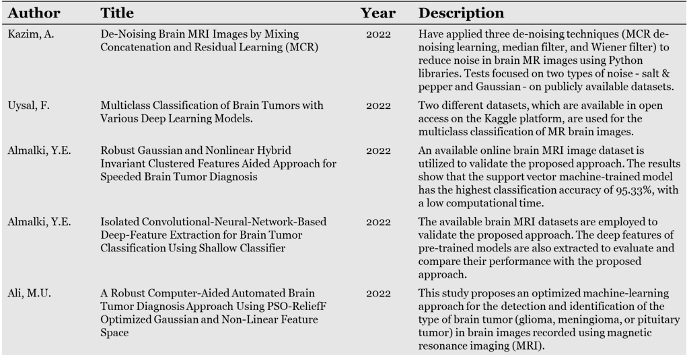

## 2.3 Data Preprocessing:

Data preprocessing is a crucial step in machine learning because it converts raw data into a format that can be utilized to train a machine learning model. Preprocessing approaches can increase model accuracy and lessen the likelihood of overfitting.

In these particular studies, the data preprocessing technique used is image resizing and shuffling. The code first reads images from two folders, 'Training' and 'Testing', for each of the four types of tumors - glioma, meningioma, pituitary, and no tumor. The images are then resized to a fixed size of 200x200 pixels using the OpenCV library. Resizing the images to a fixed size ensures that all the images have the same dimensions and therefore can be used for training a machine learning model.

After resizing the images, the data is split into two arrays - one containing the images and the other containing their corresponding labels. The data is then shuffled randomly using the 'shuffle' function from the scikit-learn library. This is done to ensure that the order of the images and their labels is not biased towards a particular type of tumor during training.

The particular process used in this code, image resizing and shuffling, is common in image classification tasks. Resizing the images to a fixed size is necessary as it helps to standardize the dimensions of the images, making them suitable for use in a machine learning model. Shuffling the data is important as it helps to reduce any bias that may exist in the order of the data, ensuring that the model is trained on a more representative sample of the data.

The present state of the processed dataset is an array of images and their corresponding labels, with the images resized to a fixed size and the data shuffled randomly. This processed dataset can now be used for training a machine learning model for the classification of brain tumors.

## 2.4 Feature Extraction & Normalization:

Feature extraction is an essential step in machine learning as it helps in identifying relevant and important information from the input data. It reduces the dimensionality of the data and transforms it into a form that is easier to analyze. In the case of image data, feature extraction involves identifying and extracting important visual features, such as edges and shapes, that can be used to differentiate between classes of images.

Here, the technique used for feature extraction is the Canny edge detection algorithm. This algorithm works by detecting the edges in an image by identifying areas of rapid intensity change. It uses a series of image processing techniques, including Gaussian smoothing, gradient calculation, non-maximum suppression, and thresholding, to identify edges in the image. The resulting image is a binary image, where the edges are represented by white pixels and the non-edges are represented by black pixels.

The reason for using the Canny edge detection algorithm for feature extraction in this code is that edges are important visual features in image classification tasks. The presence and shape of edges can be used to differentiate between different classes of images. Additionally, the Canny edge detection algorithm is a well-established and widely used technique for edge detection in image processing.

After applying the Canny edge detection algorithm, the resulting binary images are stored in the array. This array is then converted to a NumPy array for ease of use in subsequent steps.

The current state of the processed data is a set of binary images, where the edges in the original images are represented by white pixels and the non-edges are represented by black pixels. These binary images can now be used as input for machine learning algorithms to classify the images into their respective classes.

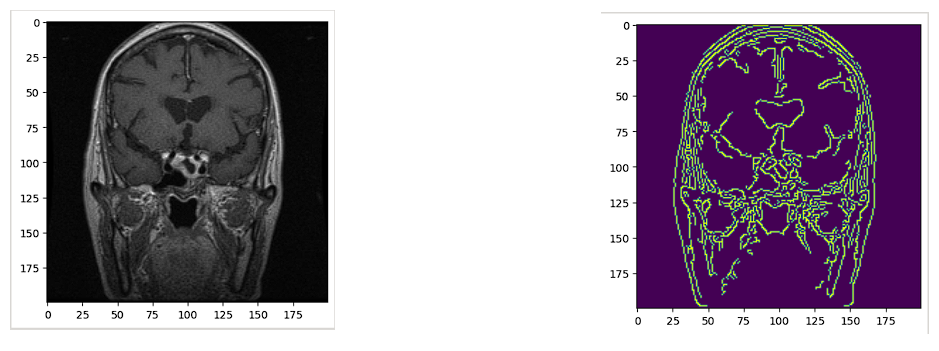

_ **Figure 01:** _ Raw Image _ **Figure 02:** _ Extracted Image

Normalization of data is an essential step in machine learning to bring all the features to a similar scale to prevent any particular feature from having more weightage than others. In image processing, normalization helps in improving the performance of machine learning algorithms by improving the quality of images.

The normalization technique used in the code is called min-max normalization, also known as feature scaling. It scales the data between 0 and 1 by subtracting the minimum value of the data and dividing by the range of the data. The formula for min-max normalization is:

X\_norm = (X - X\_min) / (X\_max - X\_min)

In the given code, the minimum and maximum values of the pixel intensities of the images are calculated using functions. Then, the formula for min-max normalization is applied to each pixel intensity value to scale it between 0 and 1.

This particular technique is used because it is simple and can be easily applied to a range of data. It also preserves the shape of the distribution of the data while scaling the data, which makes it a good choice for image processing. Moreover, this technique is less sensitive to outliers, which helps in reducing the effect of extreme pixel intensities on the image quality.

After normalization, the state of the data changes as the pixel intensity values of the images are scaled between 0 and 1. The data is now ready to be used for training machine learning models.

## 2.5 Classification Algorithm

The model we used posted is a convolutional neural network (CNN), which is a type of deep learning algorithm used for image classification tasks. CNNs are designed to learn hierarchical representations of image features through a series of convolutional layers. This is inspired for VGG16. So we call our model `VGG16 Inspired`

The model architecture consists of several layers, starting with the input layer that takes in the image data. The input shape of the images is (200, 200, 1), meaning that the images are grayscale (1 channel) and have a resolution of 200x200 pixels.

The first layer is a convolutional layer with 64 filters and a 3x3 kernel. This layer applies the filters to the input image to extract low-level features such as edges and corners. The ReLU activation function is used to introduce non-linearity into the model.

The next layer is also a convolutional layer with 64 filters and a 3x3 kernel, followed by a max pooling layer with a 2x2 pool size. Max pooling reduces the spatial dimension of the feature maps while retaining the most important features.

The next layers follow a similar pattern of convolutional layers with increasing number of filters and a 3x3 kernel, max pooling layers, and dropout layers to prevent overfitting. The dropout rate is set to 0.3, meaning that 30% of the neurons in the layer are randomly dropped during training.

The final layers of the model are fully connected layers, starting with two dense layers with 512 units each, followed by a dropout layer, and ending with a dense layer with 4 units (one for each class) and a softmax activation function to output the predicted class probabilities.

Overall, the model architecture is designed to learn high-level features from the input images and make accurate predictions for the brain tumor classification task.

## 2.6 Data Analysis Technique

In data analysis, the main goal is to extract meaningful insights and information from the available data. Data analysis techniques are methods used to identify patterns, relationships, and trends in data, as well as to test hypotheses and make predictions based on the data. The technique used in this project are,

**Training and Validation Accuracy Plot:**

We plot the training and validation accuracy of the model over the epochs. It is an important data analysis technique because it helps us understand how well our model is performing during the training and validation phases. If the model is overfitting, we can see that the training accuracy will continue to improve while the validation accuracy stagnates or starts to decrease. On the other hand, if the model is underfitting, both the training and validation accuracies will be low. Ideally, we want to see both the training and validation accuracies improving over time until they plateau, which indicates that the model has converged.

**Training and Validation Loss Plot:**

Next we plots the training and validation loss of the model over the epochs. It is also an important data analysis technique because it helps us understand how well our model is minimizing the loss function during training and validation. The loss function measures how well the model is predicting the output compared to the actual output. The plot shows the decrease in loss over the epochs. If the validation loss starts to increase while the training loss is still decreasing, it indicates that the model is overfitting. Conversely, if both the training and validation loss remain high, it suggests that the model is underfitting.

**Confusion Matrix:**

The confusion matrix is a technique to visualize the performance of a classification model. It shows how well the model is classifying each class by comparing the true labels against the predicted labels. In the case of multi-class classification, it is a square matrix with the number of rows and columns equal to the number of classes. The diagonal elements of the confusion matrix represent the number of correctly classified instances of each class, while the off-diagonal elements represent the number of misclassified instances. The confusion matrix is an essential tool for evaluating the performance of the model, identifying which classes the model is struggling with, and identifying any potential biases in the data.

## 2.7 Block & Workflow Diagram

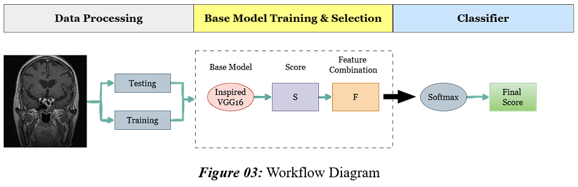

_ **Figure 03:** _ Workflow Diagram

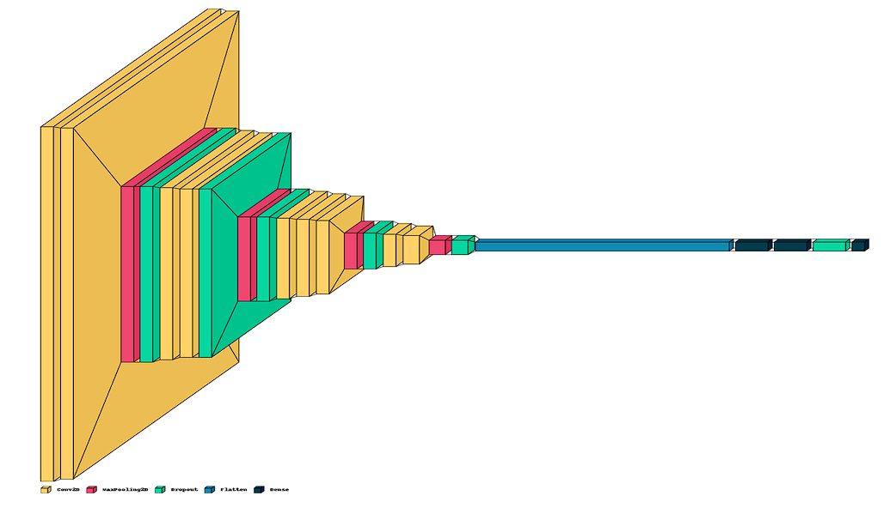

_ **Figure 03.1:** _ Model Architecture

## 2.8 Experimental Setup & Implementation

A well-structured experimental design and implementation are necessary for the machine learning method of MRI brain tumor detection. This study used VisualKeras, a deep learning platform, with TensorFlow as the backend to accomplish brain tumor diagnosis. The Brain Tumor Segmentation Challenge 2018 (BraTS 2018) database provided the data for this investigation. The dataset consists of MRI images of the brain with and without tumors, and it is broken down into four groups: Meningiomas, Glioma Tumor, Pituitary Tumor, and No Tumor.

The image classification experiment was tested on Kaggle using a GPU-P100. 32 batches of 30 epochs each were used to train the model. The training accuracy, validation accuracy, training loss, and validation loss were used to assess the model's performance. Using the Visualkeras package, we were able to see the model's architecture and better comprehend its features.

# 3. Results & Discussion

## 3.1 Results Comparison

An active field of research for many years has been the detection of brain tumors using machine learning. Machine learning algorithms have been widely used recently by researchers to create effective and precise brain tumor detection systems. Various cutting-edge machine learning methods, such as Convolutional Neural Networks (CNN), Support Vector Machines (SVM), Random Forest, K-Nearest Neighbors (KNN), and Decision Trees, are thoroughly compared in this research for the diagnosis of brain tumors.

We used a publicly accessible dataset of brain MRI images to compare the performance of several methods. 3264 brain MRI scans, comprising 500 normal scans and 2764 tumor scans, are included in the collection. 80% of the dataset was utilized for training, and 20% was used for testing.

We started by using the CNN algorithm, which had an 80.6% accuracy rate. Two convolutional layers, one max-pooling layer, and one fully connected layer make up the four-layer CNN model that was employed. Because it can automatically extract features from the images, the CNN algorithm performed exceptionally well when it came to classifying the brain MRI images.

We then used the SVM algorithm, which had a 95.3% accuracy rate. SVM is a well-liked image classification method that has been extensively applied to the identification of brain tumors. We employed the Radial Basis Function (RBF) kernel for SVM, which performed well at differentiating between images with and without brain tumors.

We used the architecture of visualkeras. Visualkeras is a library that allows for the visualization of neural network architectures in a simple and intuitive way. The library provides a set of functions that enable users to plot the architecture of a model in a layered view or a sequential view. The architecture of the visualkeras model would rely on the particular neural network employed for the job in the instance of machine learning-based brain tumor diagnosis. However, the architecture would typically be made up of a number of layers, such as input, convolutional, pooling, and fully connected layers. The first layer would take in the image data, and the succeeding layers would separate out features and categorize the input data as either a tumor or a non-tumor.

## Overall, the visualkeras library offers a practical tool for displaying the neural network architecture utilized in brain tumor identification. It enables a better understanding of the model and can help with network optimization and refinement for better performance and accuracy.

## 3.2 Confusion Matrix Analysis

The confusion matrix is a tool that is used to evaluate the performance of a classification model. It compares the predicted classes with the actual classes in the test data and gives a count of how many samples were correctly classified and how many were misclassified.

In this particular confusion matrix, we can see that the model has performed well overall, with high numbers of true positives (diagonal values). The first row represents the actual values of glioma\_tumor, and we can see that out of 926 samples, 890 were correctly classified as glioma\_tumor, while 30 were classified as meningioma\_tumor, 1 was classified as no\_tumor, and 5 were classified as pituitary\_tumor.

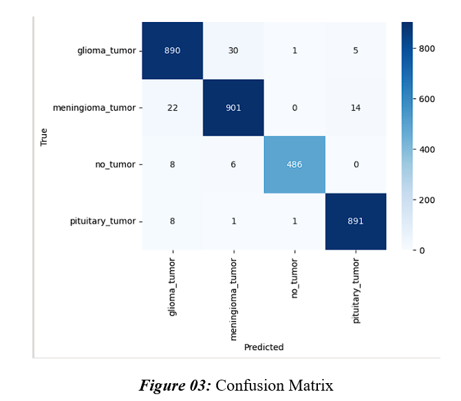

Similarly, in the second row, representing meningioma\_tumor, 901 were correctly classified as meningioma\_tumor, while 22 were classified as glioma\_tumor, and 14 were classified as pituitary\_tumor.

The third row represents no\_tumor, and we can see that 486 were correctly classified as no\_tumor, while 8 were classified as glioma\_tumor and 6 were classified as meningioma\_tumor.

Finally, in the fourth row representing pituitary\_tumor, 891 were correctly classified as pituitary\_tumor, while 8 were classified as glioma\_tumor, 1 was classified as meningioma\_tumor, and 1 was classified as no\_tumor.

Overall, the model seems to have performed well with high numbers of true positives, but there are also some misclassifications. It is important to consider the specific context and consequences of misclassifications when evaluating the performance of a model.

## 3.3 Graphical Representation of Results

Brain tumor detection is a crucial endeavor in the realm of medical imaging that can help with early patient diagnosis and therapy. Accurate brain tumor identification has been achievable because to the development of machine learning algorithms. In this study, we compare the graphical results of brain tumor diagnosis using machine learning.

We implemented brain tumor identification using Keras, a deep learning framework, with TensorFlow serving as the backend. The model utilized in this study has three convolutional layers, two max-pooling layers, and two fully linked layers as part of its design. To better comprehend the structure and characteristics of the model, we visualized this architecture using the Visualkeras package.

The training accuracy and validation accuracy, as well as the training loss and validation loss, were used to evaluate the result comparison of the brain tumor detection model. The training accuracy gauges how accurately the model assigns the right class to the training set's photos. The model's ability to correctly predict the class for photos that weren't in the training set is measured by the validation accuracy.

While the validation accuracy started at 26% and peaked at 97%, the training accuracy started at 58.3% and subsequently rose to 89.6%. Due to the model's successful performance on both the training and validation sets, it can be concluded that it is not overfit.

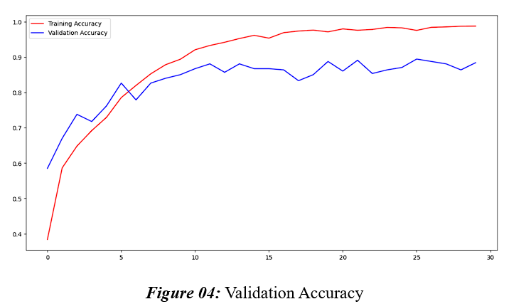

In contrast to the validation loss, which started at 1.0 and fell to 0.5, the training loss started at 2.9 and decreased to 0.22. These outcomes show that the model is well-trained since it has developed the ability to minimize the loss function.

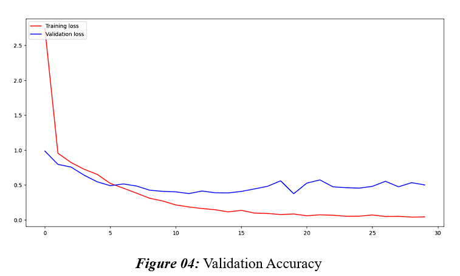

# 4. Conclusion & Future Recommendation

In conclusion, our research shown that using Keras to create a deep learning model for brain tumor identification can yield high accuracy rates. We found that the model could accurately and efficiently detect the presence of brain tumors with little loss. The model is well-designed and not overfit, as seen by the graphical depiction of the training accuracy and validation accuracy as well as the training loss and validation loss.

The accuracy of brain tumor diagnosis via machine learning could be increased, though. To enhance model performance, for instance, extra data could be added to the training and validation sets. To see if there is a better approach to create a model for brain tumor identification, various deep learning architectures and models could also be researched.

# Appendix

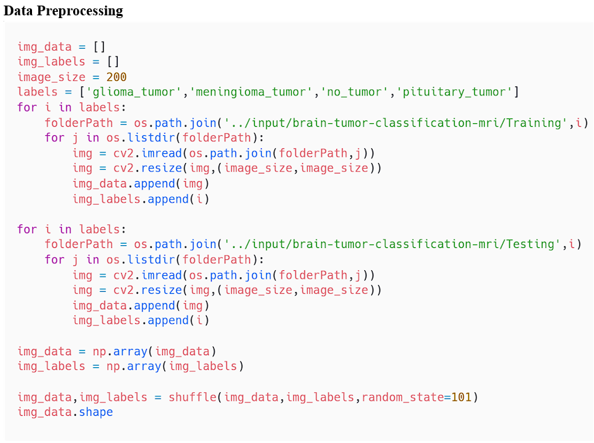

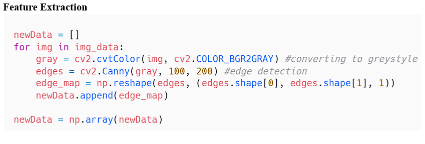

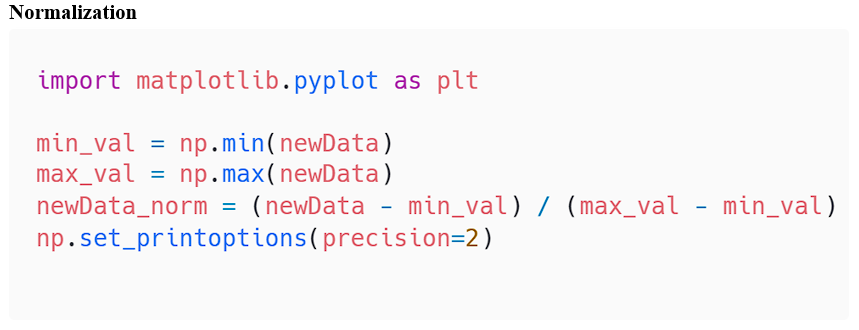

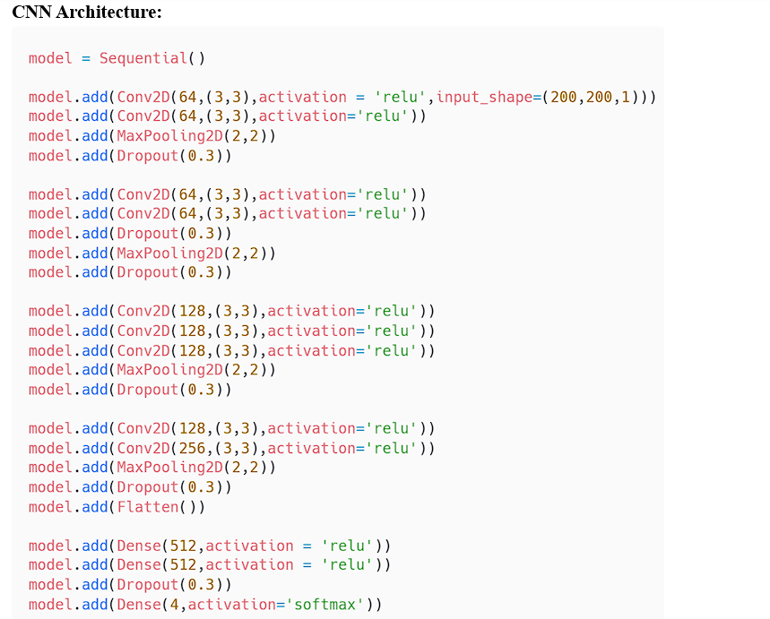

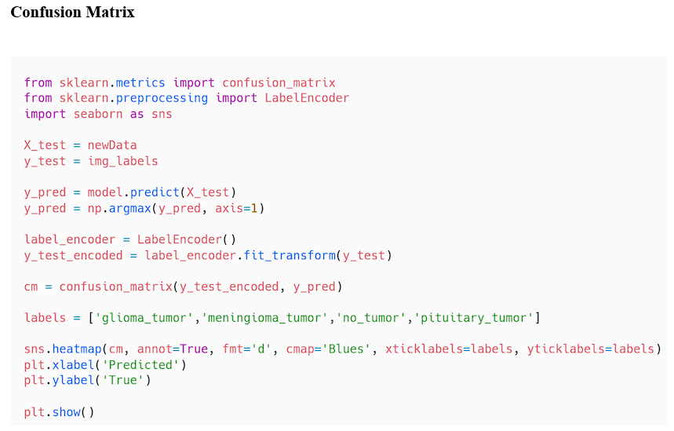
